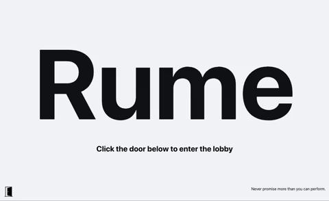

# Rume
###### An interactive emotional experience | A digital space to sit and ruminate.

## Where did it start?
When developers [Kristi](https://github.com/Kristiannmiller), [Brigette](https://github.com/BrigetteDoelp), and [Nathaniel](https://github.com/nathanielmillard), were thinking of an app they would want to build together, Rume was born of an interest in creating a design specific app that helped an already emotionally conscious user do more than "get past" or deescalate feelings. Rume creates a "space" that validates a user’s current feelings. We at Rume, believe that it's just as important to take time and feel what you are feeling, as it is to know how to guide yourself back to peace and calm.

## How can you engage with it?
Rume is a desktop experience that you can enjoy at [our deployed site](https://rume-app.herokuapp.com/), or by cloning down this repo, running npm install, and npm start to launch the app itself.
Due to the limited scope of this project as a [Turing](https://turing.io/) project, we aren't accepting contributors, but any feedback would be more than welcome to any of the three developers on this project.

## What did it take to make it?
This project was an exercise to solidify React fundamentals, explore more with React Router, React Testing Library, and API interactions. In addition to utilizing the skills we’ve used previously, we fully introduced Styled Components, GSAP animations, building a back end micro service, and used audio on a website for the first time.
While Turing does teach React, this was an opportunity for us as developers to show what we could do in a week, with technologies we taught ourselves.

## Where could it go?
It's easy to say the sky's the limit, but realistically we would love to see more dynamic options than the current four emotional inputs, a more robust and flexible journal, stronger and more interactive animations in the feeling rooms, and overall an app that is built for a variety of devices and screen sizes.

Rume currently is a great illustration for what an app could be for a specific user, but would need user authentication and reflection data persistence to be a viable app for multiple users at once over an extended period of time. Our current back end is simple, and just illustrates that something could be saved, without having a database or more dynamic endpoints for a variety of users.

[This is is our current microservice](https://github.com/nathanielmillard/rume-microservice)

## Why this tech stack?
React was the easiest choice since we knew we wanted a dynamic scalable framework with flexible modular components.
We settled on GSAP specifically because it was light weight, easy to integrate, and felt like the Goldie Locks median between high functioning and easy to implement.
Styled Components assisted significantly with conditional rendering, which is a substantial design element throughout Rume.

## How did it go?
Honestly, we feel really successful. It was exciting to determine an MVP for a project we planned from scratch. Not only did we meet our base MVP, but we managed to implement features we had only hoped we would have time for. The frequent conditional rendering created a few manageable challenges in organizational management of files, and GitHub workflow.

Given additional time, we would ideally look for bugs, manually test the limits of the app, and implement more accessibility checkpoints pertaining to color-blindness and Voiceover

## See it in action

Watch our [Virtual Tour](https://www.youtube.com/watch?v=nlUTWOdFLR8&t)

### Acknowledgements
Sounds from [noises.online](https://www.noises.online) and [mynoise.net](https://www.mynoise.net)
Music from [epidemic sound](https://www.epidemicsound.com)
Svgs from [iconmonstr](https://iconmonstr.com/)

Leta Keane and Khalid Williams - This team would like to thank the Turing Module 3 instructors for their assistance throughout this project and for their daily lessons on the magic of React.



Our Turing Mentors - Including Jon Sweet, and Turing graduates Pol Sieira & Aimee Fritz for their constant support throughout this project.

A special thanks to Leica the dog, for her frequent ~~interruptions~~ input on this project.
