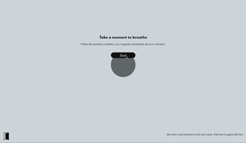
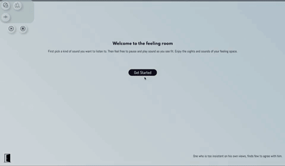
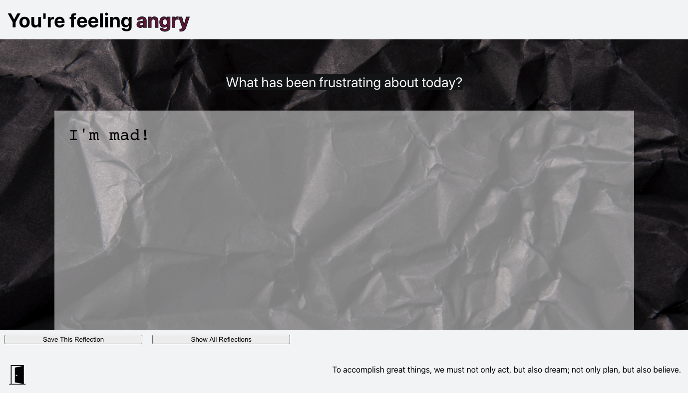
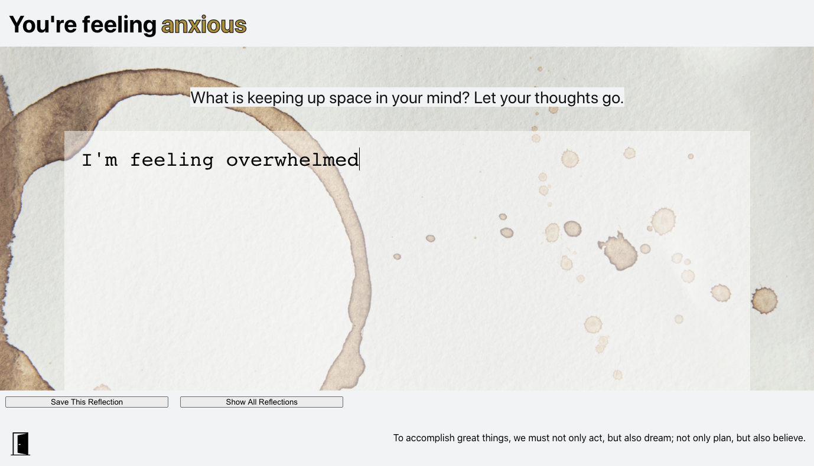
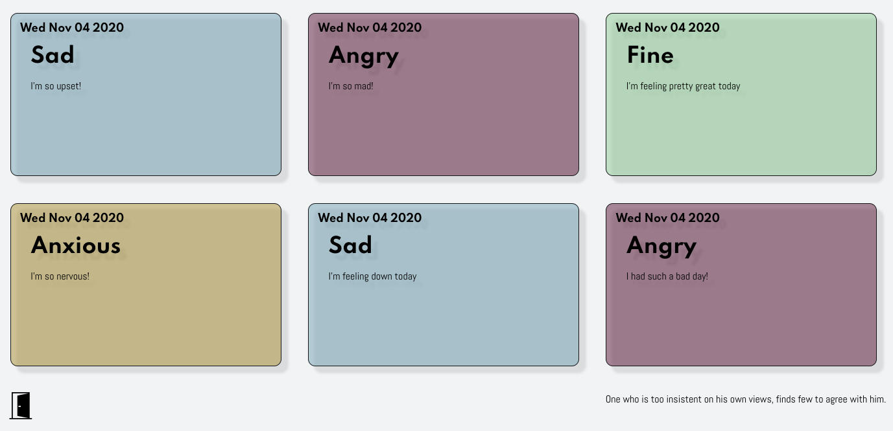

# Rume
###### An interactive emotional experience | A digital space to sit and ruminate.

## Where it started?
When developers [Kristi](https://github.com/Kristiannmiller), [Brigette](https://github.com/BrigetteDoelp), and [Nathaniel](https://github.com/nathanielmillard), were thinking of an app they would want to build together, Rume was born of an interesting in creating a design specific app that helped an already emotionally conscious user do more than "get past" or deescalate feelings, and rather create a "space" that validates a user where they are at. We at Rume, believe that it's just important to take time and feel what you are feeling, as it is to know how to guide yourself back to peace and calm.

## How to engage with it?
Rume is a desktop experience that you can enjoy at [our deployed site](https://rume-app.herokuapp.com/), or by cloning down this repo, running npm install, and npm start to launch the app itself.
Due to the limited scope of this project as a [Turing](https://turing.io/) project, we aren't accepting contributors, but any feedback would be more than welcome to any of the three developers on this projects.

## What did it take to make it?
This project was a touch point to solidify React fundamentals, explore more with React Router, React Testing Library, and Fetch calls, and fully introduce Styled Components, GSAP animations, building a back end micro service, and using audio on a website for the first time.
While our Turing does teach React, this was an opportunity for us as developers to show how much we could teach ourselves in a week.

## Where it could go?
It's easy to say the sky's the limit, but realistically we would love to see more dynamic options than four emotional inputs, a more robust and flexible journal, stronger and more interactive animations, and a app that is comfortably compatible on a variety of devices and screen sizes.
The remedy for all of these is time, but also more specified technologies we might not have access to yet. We could see implementing a machine learning API to review our user's feedback and give insight on the tone and feeling of reflections, using GSAP's scroll, drag, and physics plug ins by joining club green sock, and finding better ways to conditionally render different animations for different screen sizes, since currently we felt a bit limited and tied to pixels with GSAP, and struggled to find more dynamic units.

## Why we choose the tech stack we did?
React was the easiest choice, we knew we wanted a dynamic scalable framework with flexible modular components.
We settled on GSAP specifically because it was light weight, easy to integrate, and felt like the Goldie Locks median between high functioning and easy to learn.
Styled Components did feel like an important stylistic feature, that with more time to really refactor and look at responsibility of specific elements we may have used even more, but was certainly a great use case in the areas we did implement it for flexible reusable elements with props that could conditionally change small styling features.
Node.js and building an express service on heroku felt like our easiest option to have the most control over where our data was stored. We also felt like it was a good realm for front end students to experiment with back end. Additionally building our own back end had good implications for future scaleability and flexible functional options as our app grew.

## How was the process?
Honestly, we felt really successful. It was exciting to determine an MVP for a project we were planning from scratch, and to not only meet our base MVP, but to implement features we only hope we would have time for. Most of our challenges were around the amount of conditionally rendered choices, making sure we kept files granular and specific, and managing three people working on large complex files asynchronously.  
We would love more time to look for bugs, really manually test the limits of the app, and look at the accessibility implications of having so much of an app be visual.

## See it in action

#### Breathing Animation

#### Feeling Fine Animation

#### Feeling Sad Animation

#### Angry Reflection Page

#### Anxious Reflection Page

#### Save Reflection Library

### Aknowledgements
Sounds from [noises.online](https://www.noises.online)
Music from [epidemic sound](https://www.epidemicsound.com)
Svg from [iconmonstr](https://iconmonstr.com/)

Leta Keane and Khalid Williams - This team would like to thank the Turing Module 3 instructors for their assistance throughout this project and for their daily lessons on the magic of React.



Our Turing Mentors - Including Turing graduates Jon Sweet, Pol Sieira, and Aimee Fritz for their constant support throughout this project.
