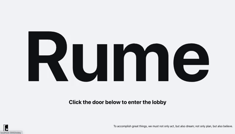
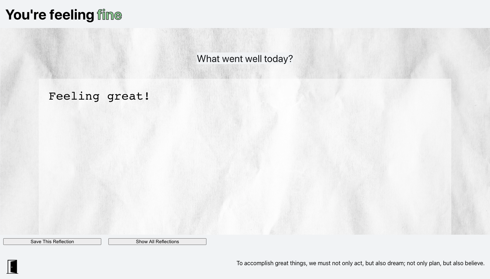
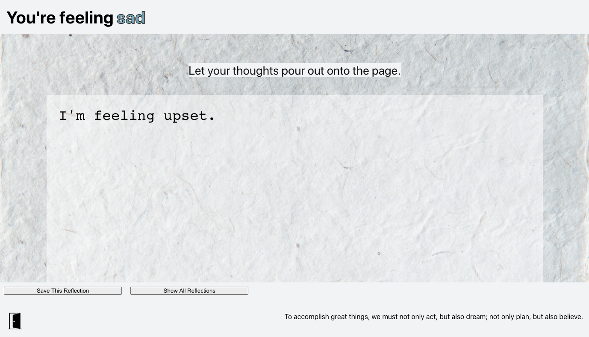
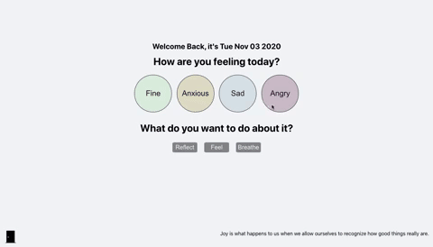

 

  
  <h3 align="center">Rume</h3>
  

    A Turing School Mod 3 Group Stretch Project
     
    <a href="https://github.com/nathanielmillard/stretch.git"><strong>Repo Link</strong></a>
     
     
  

## About The Project
Rume is a group project assigned during the third week of the third module of the Front-End Program at the Turing School of Software and Design. With a timeline of roughly 10 days, this project served as an experiment in less-taught technologies that are of interest to the members of each assigned group. This group's shared interest in animations and styled components is the driving force behind Rume.

As a group, we noticed that many meditation and therapeutic apps don't allow users to ruminate in their emotions. Rume seeks to fill this void by offering 3 different "rooms" in which to face emotions head on either through reflecting (writing), feeling (ruminating with sound and animation), or breathing (guided color-based animations).

The learning goals of this project include: cementing fundamental concepts of styled components and GSAP animations. While learning these new technologies, we also strive to sharpen skills in architecting a React application from scratch, implementing class and functional components, and utilizing React Router for path transitions and displays. Robust unit and integration testing will also be implemented for each component utilizing the Jest testing suite.

### Built With
* JavaScript
* CSS/HTML
* React
* React Router
* Jest
* Babel
* GSAP
* Express

### Installation
In your terminal:
1. Clone the repo-
`git clone git@github.com:nathanielmillard/stretch.git`
2. Install NPM packages- `npm install`
3. Start application- `npm start`

## Usage
#### LANDING PAGE

#### LOBBY

#### REFLECT RUMES
###### 'Fine' Reflecting

###### 'Anxious' Reflecting

###### 'Sad' Reflecting

###### 'Angry' Reflecting

#### REFLECTION LIBRARY

#### FEEL RUMES
###### 'Fine' Feeling

###### 'Anxious' Feeling

###### 'Sad' Feeling

###### 'Angry' Feeling

#### BREATHING RUME

## Roadmap
The total time allotted for this project was approximately 10 days. Future features contemplated by the developers include the following:

* Adding a self-contained quotes api for the quote of the day
* Additional options for breathing animations
* Additional styling and animations to the reflection library
* Deploying library to Heroku

See the [open issues](https://github.com/nathanielmillard/stretch/issues) for a list of proposed features (and known issues).

## Contact
[Kristi Miller - Developer](https://github.com/Kristiannmiller)

[Nathaniel Millard - Developer](https://github.com/nathanielmillard)

[Brigette Doelp - Developer](https://github.com/BrigetteDoelp)

Project Link: [Rume](https://github.com/nathanielmillard/stretch)

## Acknowledgements
Leta Keane and Khalid Williams - This team would like to thank the Turing Module 3 instructors for their assistance throughout this project and for their daily lessons on the magic of React.

Our Turing Mentors - Including Turing graduates Jon Sweet, Pol Sieira, and Aimee Fritz for their constant support throughout this project.
